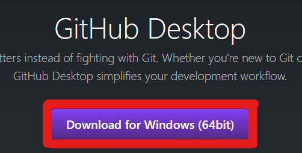
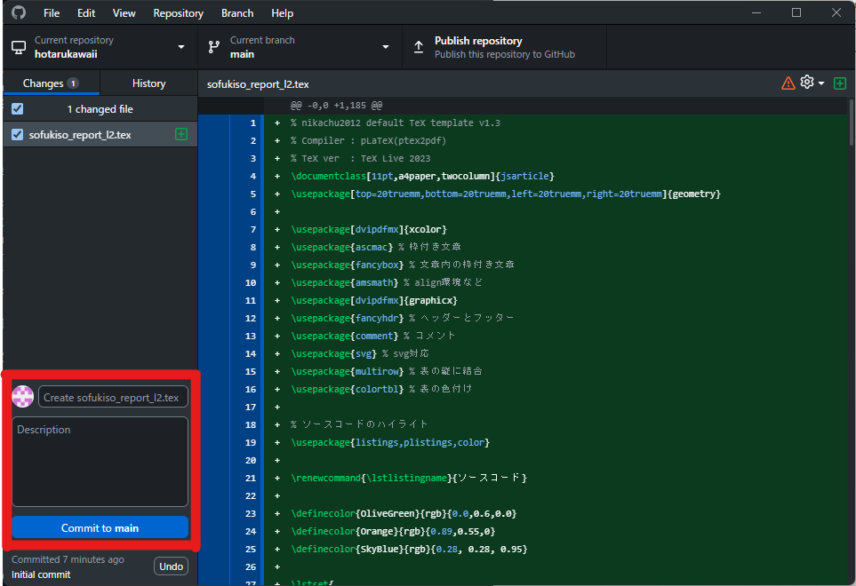

+++
title = 'GitHub使う'
author = 'nikachu2012'
description = "GitHubをとりあえず使えるようになるためのガイド。"
date = 2024-02-11T22:38:24+09:00
tags = ["github", "howto"]
series = []
alias = []
+++

この記事は、筆者の学校で掲示していた[TeX文書]()を、[Pandoc](https://pandoc.org/)を用いてMarkdownに変換したものである。
十分気を付けて公開しているが、何か問題があれば教えてほしい。

## はじめに

読者の皆様は、コードを書いた際、どこに保存すればよいか迷ったことはないだろうか。

適当な場所に保存すると、間違って消してしまうなどのリスクもある。実際、私もダウンロードフォルダに適当に置いたレポートを、誤って消してしまって絶望した記憶がある。

こんな時に利用できるのが、ソースコード管理を行うことができるGitである。今回は、Gitのサーバとしてよく使われているGitHubの簡単な使い方を解説する。

## まずはインストール

まずインストールから行う。gitは本来ターミナル[^1]で動作するものであるが、GitHubにはありがたいことに画面で操作できるGitHub
Desktopなるものがあるため、それを用いるのが簡単。

### GitHubのアカウント作成

まずは<https://github.com/join>にアクセスし、アカウントを作成する。英語のページであるが、読者の読解力であれば難なく読めると思う。

### GitHub Desktopのインストール

GitHubのアカウント作成ができたら、<https://desktop.github.com>にアクセスし[^2]、GitHub
Desktopをダウンロードする。

画面中央にある紫のボタンを押すことでダウンロードを行える。

ダウンロードされたファイルを実行すれば、特にいじらずインストールが完了する（はず）。

また、インストールが終わると、`Welcome to GitHub Desktop`なる画面が表示されるので、青い`Sign in to GitHub.com`をクリックしてGitHubにログインする。

次は`Configure Git`の画面が表示されるので、`Finish`をクリックすればインストールは完了。

## Gitの用語解説

Gitは専門用語が多いので簡単に解説する。わからない部分があればどこかで聞いてもらえれば答える。

### リポジトリ(Repository)

Git内にソースコードを置くためのフォルダのような物のこと。

### コミット(Commit)

ソースコードの変更点などを１つにまとめること。また、各コミットには変更内容などをまとめた説明などをつけることができる。

### プッシュ(Push)

変更したコミットをGitにアップロードし確定させること。

### プル(Pull)

Gitサーバ上にあるリポジトリとPC内のリポジトリ[^3]を同期させること。

## Gitの使い方

まずは上部メニューから`File`を選択し、`New repository`を選択する。

色々英語で表示されると思うが、まずは`Name`の部分にリポジトリの名前を入力する。作っている物の作品名などを入れることが多い。

`Description`には意味通り説明を入力するが、なくても問題はない。また、他の項目については項目名で調べるか聞いてもらえれば教える。

初期設定であればドキュメント(Macであれば書類)フォルダにGitHubというフォルダが作られ、その中にリポジトリ名のフォルダができている。そのフォルダが、Gitにアップロードされる。

まずは適当なファイルをそのフォルダの中にコピーしてみよう。

コピーしたあとにもう一度GitHub
Desktopを開くと、緑でソースコードが表示されていると思う。右側の緑色の部分は、コミットが作られたファイルと、されていないファイルとの差分が表示されている。

青くなった行番号が出ている部分をクリックすると、1行単位でコミットするかを選ぶことができる。

まずは初めてなら、すべての変更をコミットするのが良いと思う。慣れてきたら部分コミットなどを行うと良い。

まずは図[2]で示した赤四角部分にある、小さな入力欄に、コミットの内容を入力する。下の大きな入力欄には説明を入力するが、自分はあまり使っていない。

入力できたら、青い`Commit to (リポジトリ名)`をクリックしてコミットを作る。

次はコミットをGitHubにアップロードする。右上にある`Publish Repository`をクリックする。

初期からリポジトリについての情報が入力されているので、そのまま`Publish repository`をクリックしてアップロードすれば良い。

また、`Keep this code private`の部分にチェックを入れると、非公開のリポジトリとして自分のアカウントからしか見ることができなくなる。

## ２回目のコミット

ここまでで、初めてのコミットを作成し、アップロードした。2回目以降のコミットも同じような形で行うことができる。

まずソースコードを変更し、左下の部分でコミットを作成する。その次に右上の`Push origin`[^4]を押すことで新しく作成したコミットをアップロードすることができる。

## 終わりに

Gitの基本の使い方について解説した。

また、この文書は<https://blog.nikachu.net/git_tukaungo.pdf>にあるので、興味を持った人は見てみてほしい。

ここから下はおまけ。

## コミットの説明の書き方

コミットの説明の書き方に迷う人が多いと思う。変更点を書けば良いが、書くときのコツを記す。
まずは最初に変更の要約を示すと良い。

例えば、`[init]`や`[update]`などの文字列を最初に付ける。一例は以下の表に示す。   

最初につける文字列|意味
---|---
`[init]`|最初のコミットにつ ける
`[update]`|更新があるとき
`[add]`|追加したとき
`[fix]`|バグ修正を行ったとき
`[hotfix]`|重大なバグ修正を行ったとき
`[remove]`|削除を行ったとき

これはあくまで一例であり、最適解でも無いので慣れてきたら自分でいろいろ試したほうが良いと思う。

## Gitの便利な点

この話は少し専門的な話なのでわかる人向け。
Gitは、分散型のソースコード管理システムのことである。なぜ分散型なのかというと、Gitはリポジトリのすべてを、サーバ上から毎回自分のPCにコピーする。

そのため、リポジトリのコピーは共同で開発するほど多くのコンピュータに保存されることになるため、分散型であると言える。

[^1]: WindowsではコマンドプロンプトやPowerShellのこと。黒い画面にテキストで色々やるやつ。

[^2]: <https://docs.github.com/ja/desktop/installing-and-authenticating-to-github-desktop/installing-github-desktop>も参考

[^3]: Gitサーバ上にあるものをリモートリポジトリやremote,originなどと呼び、PC内にあるものをローカルリポジトリやlocalと呼ぶ。

[^4]: 1回目で押したPublish Repositoryのボタンと同じ場所
